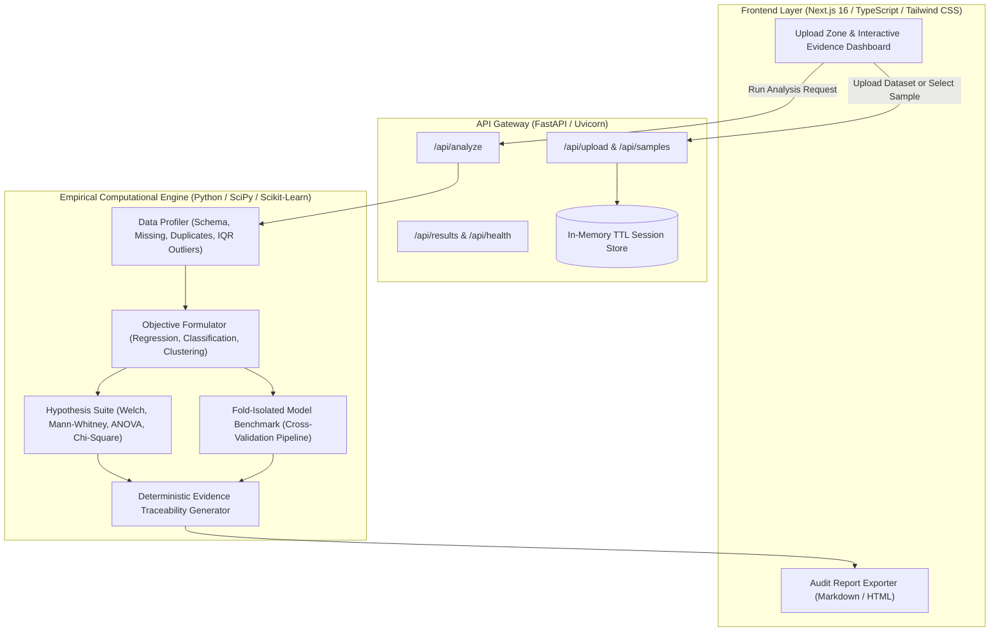

# Infera

[](https://python.org)
[](https://fastapi.tiangolo.com)
[](https://nextjs.org)
[](https://www.typescriptlang.org)
[](LICENSE)
[](#testing--verification)

> **Turn data into evidence.**

Infera is an automated empirical data science platform designed to transform raw tabular datasets into verifiable statistical evidence. It profiles dataset health, tests hypothesis assumptions, enforces zero-leakage cross-validation across predictive models, and outputs reproducible reports.

---

## Core Principle

> **"Infera does not guess. It computes, validates, and explains."**

Every finding produced by Infera originates directly from deterministic numerical algorithms in Python, Pandas, SciPy, and Scikit-Learn. The platform never fabricates metrics, never estimates values without proof, and grounds all conclusions in computed sample moments, test statistics, degrees of freedom, and exact p-values.

---

## Key Capabilities

### 1. Automated Data Quality & Schema Profiling
- In-memory type detection across numerical, categorical, datetime, text, boolean, and constant identifiers.
- Missing data diagnostic grading severity from clean to severe.
- Row duplicate detection and key collision analysis.
- Tukey Interquartile Range (IQR 1.5x fence) and Z-score outlier detection, distinguishing natural distribution tails from measurement errors.
- Deterministic 0 to 100 Data Health Score.

### 2. Statistical Inference & Hypothesis Testing (&alpha; = 0.05)
- **Two-Sample Tests**: Evaluates variance homogeneity using Levene test to select Welch t-test or Student t-test, complemented by non-parametric Mann-Whitney U.
- **Multi-Group Tests**: Parametric One-Way ANOVA and non-parametric Kruskal-Wallis H-test.
- **Categorical Independence**: Pearson Chi-Square (&chi;&sup2;) test of independence with contingency tables.
- Transparent reporting documenting null hypothesis ($H_0$), alternative hypothesis ($H_1$), test statistic, degrees of freedom, exact p-value, and plain-English conclusions.

### 3. Leakage-Free Predictive Modeling & Validation
- **Regression Suite**: Dummy baseline, Ordinary Least Squares, Ridge (L2), Lasso (L1), ElasticNet, Random Forest, and Gradient Boosting.
- **Classification Suite**: Stratified baseline, Logistic Regression, Random Forest, and Gradient Boosting.
- **Fold-Isolated Preprocessing**: Imputers, scalers, and one-hot encoders are fit strictly inside each cross-validation fold to guarantee zero test leakage.
- **Balanced Metrics**: R², RMSE, MAE, Accuracy, Precision, Recall, Macro F1, and ROC-AUC with explicit class imbalance detection.

### 4. Interactive Diagnostics & Evidence Verification
- Distribution histograms with skewness and kurtosis moments.
- Pearson and Spearman correlation heatmaps with significance filters.
- Actual vs. predicted parity plots and residual distribution diagnostics.
- Classification confusion matrices and feature importance rankings.
- Unsupervised K-Means clustering with optimal silhouette scores and PCA projections.
- Expandable **View Evidence** drawer for every finding with mathematical formulas and raw sample parameters.
- Exportable audit reports in Markdown and standalone HTML.

---

## Architecture Overview



---

## Technology Stack

| Component | Technology | Rationale |
| :--- | :--- | :--- |
| **Backend Core** | Python 3.12+, Pandas, NumPy, SciPy, Scikit-Learn, Statsmodels | Deterministic, verifiable scientific computing algorithms. |
| **API Framework** | FastAPI, Pydantic v2, Uvicorn | High-performance asynchronous API with strict request validation. |
| **Frontend** | Next.js 16 (App Router), TypeScript, Tailwind CSS, Lucide Icons | Responsive interface focused on evidence presentation without external UI bloat. |
| **Code Quality** | pytest, pytest-asyncio, httpx, Ruff | Automated test suites and strict code style enforcement. |

---

## Getting Started

### Prerequisites

- Python 3.12 or newer
- Node.js 20 or newer with npm
- Git

### 1. Clone Repository

```bash
git clone https://github.com/iamaritrasaha/infera.git
cd infera
```

### 2. Backend Setup

```bash
cd backend
python -m venv .venv
source .venv/bin/activate
pip install -r requirements.txt
pip install -e ".[dev]"

# Run tests
pytest tests/

# Start FastAPI server
uvicorn app.main:app --host 0.0.0.0 --port 8000 --reload
```

The backend will be available at:
- Service Health: `http://localhost:8000/health`
- OpenAPI Documentation: `http://localhost:8000/docs`

### 3. Frontend Setup

In a new terminal window:

```bash
cd frontend
npm install
npm run dev
```

Open `http://localhost:3000` in your browser.

---

## Docker Deployment

To launch the entire platform in isolated containers:

```bash
docker compose up --build
```

- Frontend: `http://localhost:3000`
- Backend API and Documentation: `http://localhost:8000/docs`

For production deployment instructions on Render and Vercel, refer to [DEPLOYMENT.md](DEPLOYMENT.md).

---

## Testing & Verification

Run automated tests and code checks across the codebase:

```bash
# Backend pytest suite (27 tests)
backend/.venv/bin/pytest backend/tests/

# Ruff linter
backend/.venv/bin/ruff check backend/

# Frontend production build
cd frontend && npm run build
```

---

## Author

Created and maintained by **Hrik** ([@iamaritrasaha](https://github.com/iamaritrasaha)).

---

## Copyright & License

Copyright (c) 2026 Hrik ([@iamaritrasaha](https://github.com/iamaritrasaha)). All rights reserved.

Distributed under the terms of the [MIT License](LICENSE).
