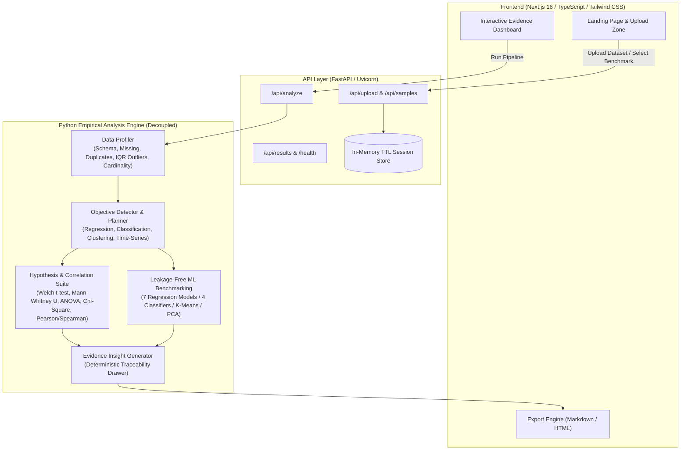

# Infera — Automated Data Science Platform

> **Turn data into evidence.**

Infera is an automated empirical data science platform. It allows users to upload a structured tabular dataset (CSV, XLSX, JSON, Parquet) and instantly profile its data quality, detect statistical relationships, formulate problem objectives, benchmark machine learning models with strict leakage prevention, test hypotheses, and generate evidence-backed reports.

---

### Key Principle

> **"Infera doesn't guess. It computes, validates, and explains."**

The platform operates on pure mathematical and empirical computations using Python, Pandas, SciPy, and Scikit-Learn. It does not fabricate metrics or rely on external LLM APIs for calculations. Every insight is traceable to computed sample moments, test statistics, and p-values.

---

## Architecture Overview



---

## Features

- **Automated Data Profiling:**
  - In-memory schema detection (numerical, categorical, datetime, text, boolean, constant, and identifier columns).
  - Missing data diagnostic with severity ratings (clean, minor, moderate, severe).
  - Exact row duplicate analysis and key column collision detection.
  - Tukey's Interquartile Range (IQR 1.5&times; fence) and Z-score outlier detection, distinguishing natural tail extremes from potential data corruption.
  - Deterministic 0–100 Data Health Score.

- **Objective Formulation & Planning:**
  - Automatic problem type inference: Regression, Binary Classification, Multiclass Classification, Clustering, Time-Series Diagnostics, or Exploratory Analysis.
  - Explains **why** a target and problem type was selected (e.g. *"price is numerical, has 242 unique observations, and represents a continuous outcome"*).
  - Explicit analysis admissibility ledger tracking skipped algorithms with statistical rationale.

- **Hypothesis Testing Suite (&alpha; = 0.05):**
  - **Two-Sample Tests:** Evaluates variance equality with Levene's test to select Welch's t-test or Student's t-test. Complemented by non-parametric **Mann-Whitney U**.
  - **Multi-Group Tests:** Parametric **One-Way ANOVA** and non-parametric **Kruskal-Wallis H-test**.
  - **Categorical Association:** **Pearson Chi-Square (&chi;&sup2;)** test of independence with contingency tables.
  - Documents null hypothesis ($H_0$), alternative hypothesis ($H_1$), test statistic, exact p-value, and plain-English interpretation.

- **Machine Learning Benchmark & Leakage Prevention:**
  - **Regression Suite:** DummyRegressor (baseline), Linear Regression, Ridge (L2), Lasso (L1), ElasticNet (L1+L2), Random Forest (100 trees), Gradient Boosting (100 trees).
  - **Classification Suite:** DummyClassifier (prior baseline), Logistic Regression, Random Forest, Gradient Boosting.
  - Preprocessing transformers (median/mode imputers, StandardScaler, OneHotEncoder) fit strictly on training partitions and evaluated on held-out test data.
  - 5-fold cross-validation, R², RMSE, MAE, Accuracy, Macro F1, Precision, Recall, and ROC-AUC.
  - Class imbalance detection with explicit warnings and trade-off explanations.

- **Visual Diagnostics:**
  - Interactive histograms with bin hover inspections, skewness, and kurtosis moments.
  - Full Pearson & Spearman correlation heatmaps with significance filters.
  - Regression actual vs. predicted parity plots and residual distribution charts.
  - Classification confusion matrices with normalized class proportions.
  - Relative feature importance bar charts.
  - Unsupervised K-Means clustering with optimal silhouette scores and 2D PCA projections.

- **Evidence-Backed Insights & Reports:**
  - Every finding contains an expandable **"View Evidence"** drawer displaying formulas, test statistics, and raw parameters.
  - Exportable audit reports in **Markdown (.md)** and standalone **HTML (.html)**.

- **Zero-Budget & Privacy by Design:**
  - Runs on ₹0 during development and production.
  - Datasets are processed in-memory and held in a temporary TTL cache (1 hour). No persistent database is required.
  - Never logs dataset row contents or prints sensitive records.

---

## Technology Stack

| Layer | Technologies | Justification |
| :--- | :--- | :--- |
| **Backend Brain** | Python 3.12+, Pandas, NumPy, SciPy, Scikit-Learn, Statsmodels | Industry-standard scientific computing libraries providing verifiable, deterministic algorithms. |
| **API Layer** | FastAPI, Pydantic v2, Uvicorn | High-performance asynchronous API framework with automatic OpenAPI documentation and strict data validation. |
| **Frontend** | Next.js 16 (App Router), TypeScript, Tailwind CSS v4, Lucide Icons | Clean, responsive, accessible interface with zero heavy third-party dashboard templates. |
| **Testing & Quality** | pytest, pytest-asyncio, httpx, Ruff | Fast automated testing and linting enforcing strict Python standards. |

---

## Pre-Packaged Sample Benchmarks

Infera ships with 4 built-in sample datasets located in `sample_data/`:

1. **Housing Sales (`housing.csv`):** 250 properties with square footage, room counts, and sale prices. Ideal for regression benchmarking.
2. **Customer Churn (`customer_churn.csv`):** 300 telecom accounts with contract types and tenure. Benchmarks binary classification and class imbalance.
3. **Student Performance (`student_performance.csv`):** 250 student study habits, attendance, and exam tiers. Benchmarks multiclass and continuous score prediction.
4. **Retail Store Sales (`retail_sales.csv`):** 200 store sales records across calendar dates with economic indicators. Benchmarks time-series diagnostics and ADF stationarity.

---

## Local Development Setup

### Prerequisites

- Python 3.12+ (and [uv](https://github.com/astral-sh/uv) recommended)
- Node.js 20+ and npm

### 1. Clone the Repository

```bash
git clone https://github.com/username/infera.git
cd infera
```

### 2. Backend Setup

```bash
cd backend

# Create virtual environment and install dependencies
uv venv --python 3.12
source .venv/bin/activate
uv pip install -e ".[dev]"

# Run tests to verify the computational engine
pytest tests/

# Start FastAPI development server
uvicorn app.main:app --host 0.0.0.0 --port 8000 --reload
```

The backend is now available at:
- **API Health:** `http://localhost:8000/health`
- **Interactive OpenAPI Documentation:** `http://localhost:8000/docs`

### 3. Frontend Setup

In a new terminal:

```bash
cd frontend

# Install dependencies
npm install

# Start Next.js development server
npm run dev
```

Open `http://localhost:3000` in your browser.

---

## Docker Development

To run both the backend and frontend using Docker Compose:

```bash
docker compose up --build
```

- Frontend: `http://localhost:3000`
- Backend API & Docs: `http://localhost:8000/docs`

---

## Free-Tier Deployment Strategy (₹0 Budget)

### Backend Deployment (Render Free)

1. Connect your GitHub repository to [Render](https://render.com/).
2. Create a new **Web Service**:
   - **Runtime:** Python 3
   - **Build Command:** `cd backend && pip install --upgrade pip && pip install -e .`
   - **Start Command:** `cd backend && uvicorn app.main:app --host 0.0.0.0 --port $PORT`
   - **Health Check Path:** `/health`
3. Environment Variables:
   - `MAX_UPLOAD_SIZE_BYTES`: `15728640` (15 MB)
   - `MAX_ROW_COUNT`: `50000`
   - `CORS_ORIGINS`: `["https://your-frontend.vercel.app","*"]`

Alternatively, deploy using the included `render.yaml` blueprint.

### Frontend Deployment (Vercel Free)

1. Connect your GitHub repository to [Vercel](https://vercel.com/).
2. Set the **Root Directory** to `frontend`.
3. Add Environment Variable:
   - `NEXT_PUBLIC_API_URL`: `https://your-render-backend-url.onrender.com`
4. Click **Deploy**.

---

## Verification & Testing

Run the automated test suite covering independent analysis engine execution and API endpoints:

```bash
# Run all tests
backend/.venv/bin/pytest backend/tests/

# Run Ruff linter and formatting check
backend/.venv/bin/ruff check backend/
backend/.venv/bin/ruff format --check backend/

# Run Next.js TypeScript and production build verification
cd frontend && npm run build
```

---

## Future Roadmap

- [ ] Automated Time-Series ARIMA / Prophet forecasting with seasonality decomposition.
- [ ] Local offline LLM provider adapter (`LocalLLMExplanationProvider` via Ollama / Transformers) for conversational deep-dives without cloud API fees.
- [ ] Export directly to PDF with embedded vector charts.
- [ ] Automated feature interaction and polynomial expansion screening.

---

## License

This project is licensed under the [MIT License](LICENSE).
