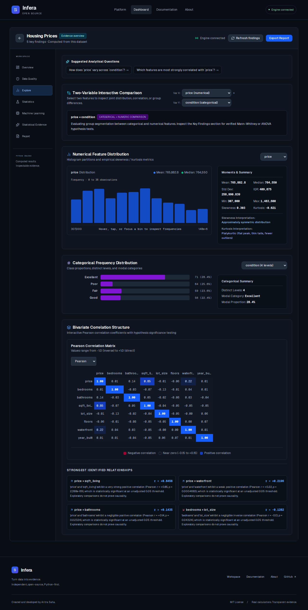
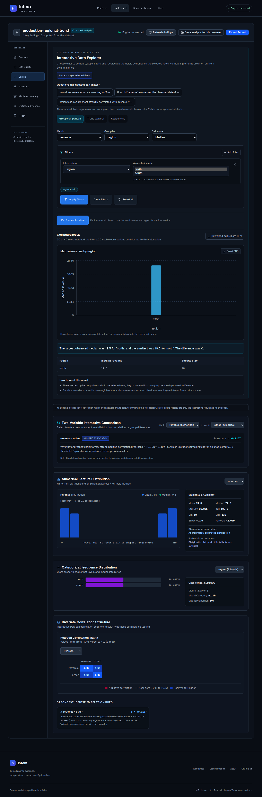

# Infera v0.5.0 Release Report

**Release:** 0.5.0
**Prepared:** 2026-10-09
**Repository:** `iamaritrasaha/infera`, branch `main`
**Creator:** Aritra Saha
**Budget:** ₹0; existing Vercel Hobby and Render Free services only

## 1. Executive summary

Infera 0.5.0 adds a Python-backed Interactive Data Explorer to the existing dashboard. Users can calculate group summaries, date trends, and numeric associations; apply bounded filters; inspect sample sizes and limitations; export aggregate CSV; and append the current exploration to a downloaded report. Optional browser-local snapshots preserve selected computed summaries without uploaded rows or session credentials.

The release also adds CI, page metadata, sitemap/robots routes, keyboard-readable charts, explicit package versions, and reproducible browser coverage. Existing v0.4 analysis, session ownership, and Render cold-start UX remain in place.

## 2. Audit findings and verified causes

- The existing Explore page showed distributions and correlations, but did not provide a general filter-and-recalculate workflow against the session-owned Python dataset. The new UI calls dedicated bounded FastAPI endpoints rather than approximating statistics in the browser.
- Discovery could surface two cards for the same metric/date overview: a direction summary and its extrema summary. A shared signature now keeps the higher-ranked overview while preserving distinct seasonality, group, relationship, and model findings.
- Date controls need actual coverage data to avoid offering intervals that are inappropriate for the observations. The options endpoint now returns unique observations, date span, and median spacing; the UI limits choices to meaningful, bounded intervals.
- Render Free can sleep, and a successful push or a health response alone does not establish that the frontend can complete an analysis. Deployment is checked by deployed commit plus a real browser workflow.
- The Vercel project is the existing `infera` Next.js project, rooted at `frontend/`; the disconnected legacy `backend` Vercel project remains disconnected.

## 3. Implemented features

- Metric, grouping, aggregation, time, and relationship selectors derived from the analyzed schema.
- Up to eight numeric, date, and categorical filters; category selectors are bounded to 100 values.
- Real group, trend, and Pearson/Spearman calculations in the Python service, with matched/usable counts, limitations, and charts.
- Suggested questions map deterministically to supported calculations; unsupported suggestions are explained.
- Finding cards load evidenced explorer controls; the user explicitly runs the calculation.
- Aggregate CSV downloads contain grouped or period-level values and sample sizes, not row-level observations.
- IndexedDB snapshots are opt-in, versioned, browser-local, capped at 20 entries and 1.5 MiB per record, and reject unsupported records safely.
- Markdown/HTML reports include the latest filtered result and active filters as a separate section. Report HTML escapes content.
- SEO/social metadata, canonical URL, sitemap, robots directives, repository/docs/about/dashboard links, and creator attribution.
- GitHub Actions checks Ruff, pytest, ESLint, TypeScript, and the optimized frontend build on pull requests and `main` pushes.

## 4. Architecture and changed areas

The browser uses the existing anonymous session header and typed API client. `POST /api/explore/options` provides bounded filter/date options; `POST /api/explore` validates a request, verifies dataset ownership, and calculates in a worker thread under the existing single-operation semaphore. Responses and charts are capped. No database, paid API, hosted model, or new runtime dependency was added.

Principal additions and changes:

- Backend: `backend/app/analysis/exploration.py`, `backend/app/api/routes/exploration.py`, `backend/app/models/schemas.py`, `backend/app/main.py`, `backend/app/analysis/insights/discovery.py`, configuration and tests.
- Frontend: `InteractiveExplorer.tsx`, `ExploreTab.tsx`, `AnalysisView.tsx`, `OverviewTab.tsx`, `InsightsTab.tsx`, `ReportTab.tsx`, API/types/schemas, snapshot and report helpers, metadata routes, and Playwright tests.
- Delivery/docs: `.github/workflows/ci.yml`, `README.md`, and this report.

See the repository diff and CI run for the complete file list.

## 5. Statistical correctness

- Group and period aggregates are calculated from filtered Python rows. Reported sample sizes are attached to each group/period.
- Trends sort actual timestamps, aggregate observations into calendar buckets, expose empty calendar periods, and cap generated buckets at 500. Chart points are reduced to at most 160; the reported trend summary uses the computed result rather than the chart sample.
- Relationships use complete numeric pairs and report pair counts. Correlation is described as association, not cause.
- Invalid/identifier/constant columns, unsupported filters, empty results, insufficient dates, and unsafe bounds are rejected or returned as explicit unavailable/empty states.
- Suggested questions are finite deterministic mappings to the supported methods; no open-ended or generated statistical answer is used.
- Independent regression examples check group medians, daily aggregates, missing calendar periods, filtering, bounds, correlation, and ownership.

## 6. Security and privacy review

- Both exploration routes require a session and call the existing owner-scoped dataset store before calculation. Dataset IDs alone do not grant access. The live browser workflow confirmed a foreign session token receives HTTP 404 for the uploaded dataset's protected results.
- Request schemas constrain modes, columns, filter values, date bounds, and result limits; invalid column references return a client error without exposing a traceback.
- Existing CORS/session headers, upload limits, private result/report caching, and no-token-in-URL behavior are preserved.
- Browser snapshots do not include dataset IDs, preview rows, raw observations, session IDs/tokens, report HTML, or per-row model predictions. Category names and aggregate statistics can still be sensitive on a shared browser profile.
- Report HTML uses escaped content; CSV export quotes and escapes cell values.
- The production isolation check must verify that a different session cannot read a freshly analyzed dataset before this report marks production complete.

## 7. Performance and bounded work

- Backend keeps a single heavy operation in flight and uses the existing admission timeout/429 response; exploration runs in a worker thread, leaving `/health` lightweight. A request now infers eligible columns once and reuses them across all filters and the chosen calculation.
- Categories, filters, unique date observations, periods, and chart payloads have explicit caps. There is no per-row chart export or second concurrent analytical worker.
- Local backend suite runtime on this checkout: 18.88 seconds for 104 tests. Local Playwright runs use one worker and the real local API. In one warm production browser run, upload took 725 ms, analysis 1,412 ms, group calculation 683 ms, filter calculation 674 ms, and trend calculation 748 ms. The sample is recorded in `docs/release-evidence/v0.5.0/production-timings.json`; it is not a percentile or load test.
- Render Free cold start time remains variable and may exceed a minute. These sample timings are not a large-file, concurrency, or worst-case stress test.

## 8. Verification record

| Check | Result |
| --- | --- |
| Backend pytest | 104 passed; one Starlette/httpx deprecation warning |
| Ruff | Passed |
| ESLint | Passed |
| TypeScript | Passed |
| Next.js optimized production build | Passed with `NEXT_PUBLIC_API_URL=https://infera-backend-tjg3.onrender.com` |
| Playwright local browser suite | 40 passed, 2 remote-only tests skipped; 55.9 seconds |
| npm production dependency audit | 0 vulnerabilities |
| Python dependency advisory audit | No known vulnerabilities (`pip-audit`) |
| Playwright production workflow | 2 passed in 33.4 seconds against the public Vercel alias and live Render API |
| `git diff --check` | Passed for the final evidence changes |

Synthetic time-series and regional values have independent expected values. The new production workflow uploads only a generated 40-row synthetic CSV, exercises the actual API through the browser, and records elapsed times. It confirmed a 20-of-40 northern-region filter, aggregate CSV output, daily buckets from January 1 through January 20, report appendices, escaping, and session isolation. No browser page errors were observed.

## 9. Before/after interface evidence

The before image is the existing v0.4 Explore page. It shows static full-dataset distributions/correlations and a two-variable picker. The after image will show the v0.5 filtered Python result and its sample counts from the live deployment.

**Before — v0.4 Explore page**

**After — v0.5 interactive filtered calculation**

## 10. Deployment evidence and remaining issues

### Vercel

- Existing project: `infera`, Next.js, root `frontend/`, Node.js 24.x, production branch `main`, production domain `infera-omega.vercel.app`.
- The Production environment contains `NEXT_PUBLIC_API_URL`; its value is intentionally not revealed in dashboard output. The live browser confirmed requests resolve to `https://infera-backend-tjg3.onrender.com`.
- Build command: `npm run build`; install command: `npm install`. No explicit output-directory override.
- GitHub production deployment for the v0.5.0 application code commit `2b2f8ff787d9315045bfd38c747427a66229d982` succeeded (deployment ID `6963386420`, success status ID `19524554203`). Its environment URL is `https://infera-1dqqkk1x9-foresight5.vercel.app`; the public alias `https://infera-omega.vercel.app` returned HTTP 200 and passed the production browser workflow. The project is GitHub-linked to `main`; the legacy `backend` Vercel project remains disconnected.

### Render

- Existing service: `srv-db405tei0phs73egmstg`, Render Free, Oregon; branch `main`, root directory blank, one Uvicorn worker, `/health` check, bounded build filters (`backend/**`, `render.yaml`).
- Build command: `cd backend && pip install -r requirements.txt && pip install --no-deps .`; start command: `cd backend && uvicorn app.main:app --host 0.0.0.0 --port $PORT --workers 1`.
- Render auto-deployed `2b2f8ff787d9315045bfd38c747427a66229d982` as deployment `dep-db4fo6oae00c73a2nkhg`; the deployment succeeded and is Live. `GET /health` returned HTTP 200 with version `0.5.0` and engine status `ready`. The production browser run completed analysis, grouping, filtering, trend calculation, report export, and isolation checks through this API.

### Release commit

- Application code commit pushed to `main`: `2b2f8ff787d9315045bfd38c747427a66229d982` (`feat: add v0.5 interactive data exploration`).
- GitHub Actions run `37945542647` succeeded with both backend and frontend jobs passing: [run details](https://github.com/iamaritrasaha/infera/actions/runs/37945542647).
- Production Playwright: 2 passed (33.4 seconds). Full browser captures are in `artifacts/production-verification/`; the before/after screenshots and timing JSON are in `docs/release-evidence/v0.5.0/`.

No new paid resources were provisioned and no existing service or billing setting was changed. Render's GitHub-linked source auto-deployed the application commit. The service include filters only deploy backend/runtime configuration changes, so a subsequent documentation and production-test-only commit does not change the running API code.

## 11. Free-tier and methodology limitations

Render Free may sleep or restart, clearing in-memory datasets. Exploration is descriptive and does not establish causality. P-values elsewhere in Infera are unadjusted exploratory results; modeling holdouts and correlations are not guarantees of deployment performance. Browser-local snapshots may contain sensitive aggregate/category information. The bounds are safeguards, not a guarantee against platform memory ceilings on unusually expensive inputs.

Created and maintained by **Aritra Saha**. Infera remains an open-source, Python-first project.
